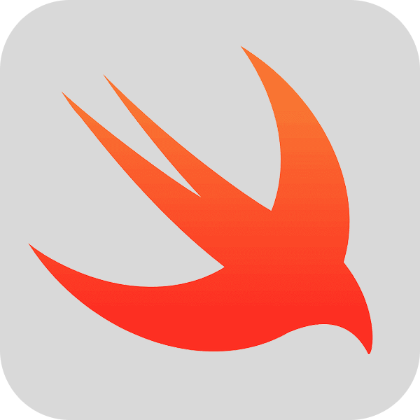

```markdown
# iOS Development Lab - Universidad Autónoma de Chiapas



Welcome to the informational webpage for the iOS Development Lab at the Universidad Autónoma de Chiapas (UNACH). This page serves as a central hub for information about our lab, the services we provide, recent news, and a showcase of projects developed by our talented students.

## About the Lab

The iOS Development Lab at UNACH is dedicated to fostering innovation and practical skills in Apple's iOS ecosystem. We aim to provide students with the resources, knowledge, and support necessary to develop their own applications and explore the world of mobile development.

## Services Offered

We offer a range of services to support students interested in iOS development:

*   **Courses:** Structured learning programs to teach iOS development fundamentals and advanced topics using Swift.
*   **Support:** Guidance and mentorship from experienced individuals for student projects and learning queries.
*   **Equipment Loan:** Access to necessary hardware (e.g., Macs) and software required for iOS development.

## News and Announcements

Stay updated with the latest happenings at the lab. This section features:

*   News about student achievements (e.g., "Students of the Universidad Autónoma de Chiapas won in Hackathon 2025").
*   Updates on courses (e.g., "A course came to an end last month").
*   Other relevant announcements and information related to the lab's activities and the broader iOS development community.

## Student Projects Showcase

We are proud to display the innovative projects created by our students. Each project showcased on our website includes:

*   The project's logo/icon.
*   The names of the student developers.
*   A detailed description of the application.
*   Two pictures or videos demonstrating the project.

## Technologies Used (for this Webpage)

This informational webpage is built using:

*   HTML
*   CSS
*   JavaScript

## Contact Information

To get in touch with the iOS Development Lab, please visit us at our physical location:

**Universidad Autónoma de Chiapas,**
**Campus IV, Facultad de Negocios,**
**Edificio 4, Planta Baja.**

---

```
